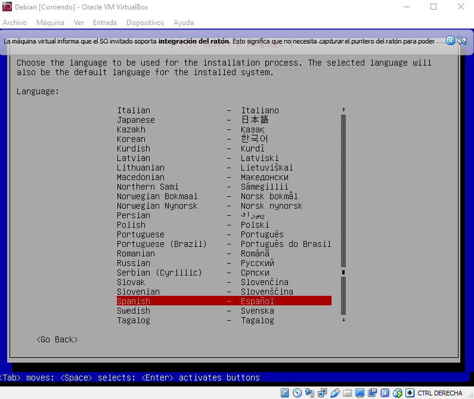

# Table of Contents
* Installation of debian


# Installation of Debian

Requirements:

 * ISO of "debian"
 * Internet
 * Virtual machine

requirements install debian:

Look, a list!

 * Mount image in virtual machine
 * Start the mounted image

# Installation process:

* Install with the option "installation"
* select desired language
* select keyboard format




Then it begins to load the additional components

## User settings and passwords

* define superuser class of your choice
* request to enter full user name
* request to create account name for user, by default is the previous option
* choose a password for the user of your choice 


## set clock
* Select time zone at your choice, varies depending on the country chosen at the beginning of the installation

## Disk partitioning
* choose the disk when partitioning which was defined at the beginning of the creation of the image
* partitioned scheme selection
* at the end of partitioning shows a summary of the changes made
* to finish we will ask for the confirmation of the writing in the changes of the discs


## Install the grub boot loader 

* Install in the main boot record


# Install and create user sudo

It must be entered as root

#### Installation commands
```
# apt-get  install sudo
```
then enter the configuration file in: 
```
# nano /etc/sudors
```
you must add our user below the root line:
```
# localhost ALL=(ALL) ALL
```

## Configure network

 * Select network configuration enp0s3
 * change default machine name "debian"


#### define domain name
 * define a domain name of your choice

# Installation and configuration of web server (apache)
#### Installation commands
```
# apt-get install apache2
```
if you want to know the ip address of the server:
```
# Ifconfig
```
#### apache configuration

Apache2 configuration files are on the route:
```
# /etc/apache2
```
the configuration file is called:
```
apache2.conf
```
**Warning: Make a backup, if you make any changes to this file, because, if apache detects any failure, it will not start.**

## NTP server

The NTP protocol is used to keep the system clock in hour. This is possible thanks to its synchronization with other NTP servers via internet.
### Installation

```
# apt-get install ntp ntp-doc
```
### check
```
# ntpq -p
```
### Utilization
To synchronize the time and date of a client system, simply execute the ntpdate command (see NTP protocol), indicating the server address:

```
# ntpdate -u 192.168.1.100
```

## Firewall installation
Uncomplicated Firewall can be installed easily by typing the following command in the terminal as superuser: 

```
# apt-get install ufw
```

However, only with the installation the firewall will not be activated automatically nor will it have any default rules. 

### Configuration
First you must enable the firewall by typing: 

```
# ufw enable
```

* Note: it can be deactivated in the same way, changing "enable" by "disable" .

* Second, you must configure the default settings. For most users the following default settings may be sufficient. 

```
# ufw default deny incoming
# ufw default allow outgoing
```
Next, it is advisable to verify that the firewall is activated by typing: 

```
# ufw status verbose
```
* Note: With this command you can also see all the rules that have been applied by default. 

#### Firewall rules:

Adding rules is quite simple from the command line and sometimes it is necessary. For example, by default ufw blocks all incoming connections, which will make it a problem if you are using SSH. Therefore, you must create a rule that allows incoming SSH connections, by typing: 

```
# ufw allow ssh
```

* Other rules can be added in the same way by simply specifying the name of the program (Deluge, Transmission). Ufw comes with default values preloaded for some of the most common programs, and they are activated automatically when you add a rule and specify the name of the program.. 

## Ssh Server

### Installation

```
root@server:~# aptitude install openssh-server openssh-client
```

### Configuration

All ssh server configurations are found in the / etc / ssh / sshd_config file.

To configure the server, the addresses where the service should respond should be indicated. In this case they will be connections linked to the address 192.168.1.100, through port 22 and using version 2 of the ssh protocol: 

```
/etc/ssh/sshd_config
```

```
# Package generated configuration file
# See the sshd_config(5) manpage for details

# What ports, IPs and protocols we listen for
Port 22
# Use these options to restrict which interfaces/protocols sshd will bind to
#ListenAddress ::
#ListenAddress 0.0.0.0
ListenAddress 192.168.1.100
Protocol 2
#[...]
```
* For security, you must deactivate the login as root. In this configuration, in order to acquire the privileges of the root, a normal user login must be done and, afterwards, acquire the root privileges. In this way, we prevent the password of the root from being attacked. 

```
/etc/ssh/sshd_config
```

```
#[...]

# Authentication:
LoginGraceTime 120
PermitRootLogin no
StrictModes yes

#[...]
```

* It should also be verified that logins with empty passwords are not allowed: 

```
/etc/ssh/sshd_config
#[...]
# To enable empty passwords, change to yes (NOT RECOMMENDED)
PermitEmptyPasswords no
#[...]
```

* Restart the service:

```
root@server:~# /etc/init.d/ssh restart
```

### check

It should be possible to establish an ssh connection to address 192.168.1.100.
The first time the connection is made, it must be confirmed, because the server is not registered in the list of systems known by the client. 
 
```
fribeiro@laptop:~$ ssh 192.168.1.100
The authenticity of host '192.168.1.100 (192.168.1.100)' can't be established.
RSA key fingerprint is ee:16:b0:c9:1b:ef:b4:64:e1:86:80:f4:36:9f:08:03.
Are you sure you want to continue connecting (yes/no)? yes
Warning: Permanently added '192.168.1.100' (RSA) to the list of known hosts.
fribeiro@192.168.1.100's password:
Linux server 2.6.32-5-amd64 #1 SMP Fri Oct 15 00:56:30 UTC 2010 x86_64

The programs included with the Debian GNU/Linux system are free software;
the exact distribution terms for each program are described in the
individual files in /usr/share/doc/*/copyright.

Debian GNU/Linux comes with ABSOLUTELY NO WARRANTY, to the extent
permitted by applicable law.

fribeiro@server:~$ logout
Connection to 192.168.1.100 closed.
fribeiro@laptop:~$
```

* Connections with the root login will not be accepted: 

```
fribeiro@laptop:~$ ssh -l root 192.168.1.100
root@192.168.1.100's password:
Permission denied, please try again.
root@192.168.1.100's password:
Permission denied, please try again.
root@192.168.1.100's password:
Permission denied (publickey,password).
```

### Installation

```
# aptitude install proftpd-basic proftpd-doc
```

During installation, you must select the "standalone" operating mode: 

#### Configuration

All the ProFTPD configuration is stored in the file: 

```
/etc/proftpd/proftpd.conf
```

The installation is predetermined to activate the IPV6 support of ProFTPD. Since our server hardly supports IPV4, the IPV6 option must be deactivated, in order to avoid error messages during service startup. 

```
/etc/proftpd/proftpd.conf
```
```
#[...]
# Set off to disable IPv6 support which is annoying on IPv4 only boxes.
UseIPv6                         off
#[...]
```
Verify that the server is configured as standalone: 
```
/etc/proftpd/proftpd.conf
```

```
#[...]
ServerName                      "Debian"
ServerType                      standalone
DeferWelcome                    off
#[...]
```

Finally, restart the ftp server:

```
# systemctl restart proftpd
```

#### Security options: access restriction

By default, the ProFTPD server allows the user to browse the entire file system to which they normally have access. However, ProFTPD allows you to restrict access to just one section of the branches of the directory tree. In this way, the client is confined to these branches, and therefore, can not access any resource outside this area, which is a very safe option.

In the ProFTPD configuration file, the DefaultRoot parameter must indicate the directory that will allow client access via ftp.
Restricted access to the // home // of the user

For this, just indicate ~ as DefaultRoot in the file /etc/proftpd/proftpd.conf:

```
/etc/proftpd/proftpd.conf
```

```
#[...]

# Use this to jail all users in their homes
DefaultRoot                     ~

#[...]
```

Next, each user that tries to access via ftp, must create a directory called ftp, in his home: 

```
fribeiro@server:~$ mkdir ~/ftp
```
Finally, you must restart the ftp service to activate the alterations: 

```
root@server:~# /etc/init.d/proftpd restart
```

#### Utilization

The FTP server can be accessed through a simple browser, or using an FTP client, such as Filezilla.
